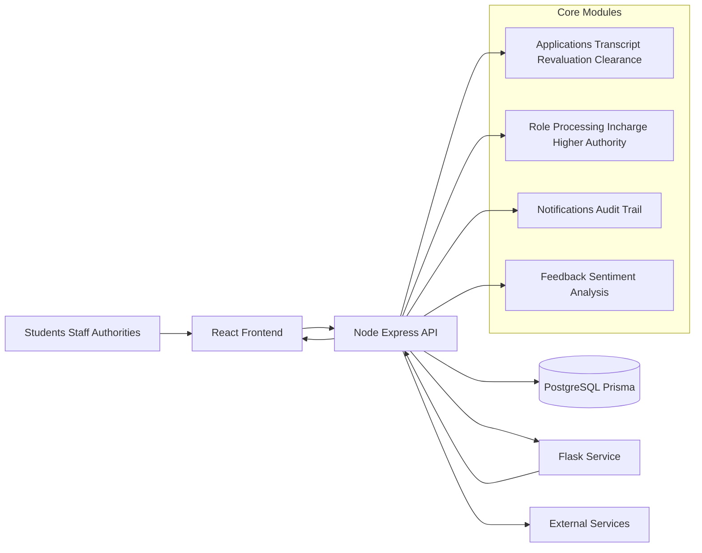

# NUCLEUS

NUCLEUS is a cloud-based platform that makes college administration simpler, faster, and transparent. It brings units like the library, exam section, and admin office into one system where students can apply for services, track progress, and get real-time updates while staff and authorities process requests digitally.

---

## Abstract

NUCLEUS streamlines academic administration by connecting departments on one platform. Students can request transcripts, revaluation, and clearance services, and track every step from a single dashboard.

Faculty, staff, and higher authorities (HODs, registrars, principals) can review and approve requests online, reducing paperwork and delays. Built-in audit logs and real-time alerts improve transparency, accountability, and coordination across departments.

The platform also supports module-wise sentiment analysis to capture feedback and help institutions improve service quality.

---

## Introduction

Many institutions still depend on manual, paper-heavy workflows for student services. This often leads to delays, poor visibility, and weak coordination across departments.

NUCLEUS solves this through a unified digital workflow where:

- Students submit and track applications digitally.
- Department staff process and route requests efficiently.
- Higher authorities review and approve requests online.
- Institutions improve turnaround time, transparency, and service consistency.

---

## Problem Statement

Educational institutions commonly face these administrative challenges:

- **Manual workflow inefficiencies:** Time-consuming, error-prone processing of forms and approvals.
- **Lack of transparency:** Limited visibility into request status for students and staff.
- **Delayed access to resources/services:** Manual dependencies cause avoidable delays.
- **Underutilized feedback:** Feedback is collected inconsistently and rarely used for improvement.
- **Unequal access:** Students/staff with physical or logistical constraints face additional barriers.

NUCLEUS addresses these issues through digitized workflows, centralized tracking, and connected communication.

---

## Simplified Architecture



---

## Project Structure

Generated and dependency folders (such as `node_modules`, virtual env folders, caches, and uploads) are omitted for clarity.

```text
Nucleus_campus/
├─ nucleus_frontend/
│  ├─ public/
│  ├─ src/
│  │  ├─ components/
│  │  ├─ config/
│  │  └─ App.jsx
│  ├─ package.json
│  └─ vite.config.js
├─ nucleus_backend/
│  ├─ config/
│  ├─ controllers/
│  ├─ middleware/
│  ├─ prisma/
│  ├─ routes/
│  ├─ services/
│  ├─ server.js
│  └─ package.json
├─ nucleus_flask_backend/
│  ├─ doc_verification/
│  ├─ app.py
│  ├─ requirements.txt
│  ├─ vectorizer.pkl
│  └─ sentiment_model1.pkl
├─ docker-compose.yml
├─ Dockerfile.api
├─ Dockerfile.frontend
└─ README.md
```

---

## Tech Stack

- **Frontend:** React, Vite, React Router, Axios
- **Backend API:** Node.js, Express, Prisma
- **Database:** PostgreSQL
- **ML/AI Service:** Flask (sentiment prediction and related services)
- **Infra:** Docker, Docker Compose

---

## Local Setup Guide

### 1) Prerequisites

- Node.js (recommended: 20+)
- npm
- Python 3.10+
- PostgreSQL 16+ (if running without Docker)
- Git

### 2) Clone and enter project

```bash
git clone <your-repo-url>
cd Nucleus_campus
```

### 3) Backend setup (`nucleus_backend`)

```bash
cd nucleus_backend
npm install
```

Create `.env` using the sample in the **Demo Environment Variables** section below.

Run database migrations/schema sync:

```bash
npx prisma generate
npx prisma db push
```

Start backend:

```bash
npm run dev
```

Backend runs on `http://localhost:5000` by default.

### 4) Frontend setup (`nucleus_frontend`)

```bash
cd ../nucleus_frontend
npm install
```

Create `.env.local` using the sample in the **Demo Environment Variables** section below.

Start frontend:

```bash
npm run dev
```

Frontend runs on `http://localhost:5173`.

### 5) Flask ML service setup (`nucleus_flask_backend`)

```bash
cd ../nucleus_flask_backend
python -m venv .venv
```

Activate virtual environment:

- **Windows (PowerShell):** `.\.venv\Scripts\Activate.ps1`
- **macOS/Linux:** `source .venv/bin/activate`

Install dependencies and run:

```bash
pip install -r requirements.txt
python app.py
```

Flask service runs on `http://localhost:5001`.

### 6) Optional: Run with Docker

From project root:

```bash
docker compose up --build
```

---

## Demo Environment Variables

Use these as starter templates (safe placeholder values only).

### `nucleus_backend/.env` (demo)

```env
PORT=5000

# Database
DATABASE_URL=YOUR_DATABASE_URL
PRISMA_DATABASE_URL=YOUR_PRISMA_POSTGRES_URL
POSTGRES_URL=YOUR_POSTGRES_URL
DB_HOST=localhost
DB_PORT=5432
DB_USER=YOUR_POSTGRES_USER
DB_PASSWORD=YOUR_POSTGRES_PASSWORD
DB_NAME=YOUR_POSTGRES_DATABASE_NAME

# Auth
JWT_SECRET=replace_with_a_long_random_secret
GOOGLE_CLIENT_ID=your_google_oauth_client_id

# Integrations
EMAIL_USER=demo@example.com
EMAIL_PASS=app_password_or_demo_value
RESEND_API_KEY=re_demo_api_key
CLOUDINARY_NAME=demo_cloud_name
CLOUDINARY_API_KEY=demo_cloudinary_key
CLOUDINARY_SECRET_KEY=demo_cloudinary_secret

# Internal service
FLASK_API_URL=http://localhost:5001
```

### `nucleus_frontend/.env.local` (demo)

```env
VITE_API_URL=http://localhost:5000
VITE_GOOGLE_AUTH_CLIENT_ID=your_google_oauth_client_id
```

### `nucleus_flask_backend/.env` (demo)

```env
# Optional paths for OCR/document utilities
TESSERACT_CMD=C:\Program Files\Tesseract-OCR\tesseract.exe
POPPLER_PATH=C:\Program Files\poppler\Library\bin
```

---

## API Health Checks

- Backend: `GET http://localhost:5000/health`
- Flask ML service: `GET http://localhost:5001/health`

---

## Future Enhancements

- End-to-end workflow analytics dashboard
- SLA and escalation reports
- Advanced sentiment trend insights by module/department
- Extended document verification pipeline

